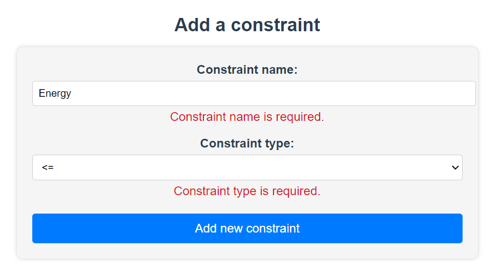
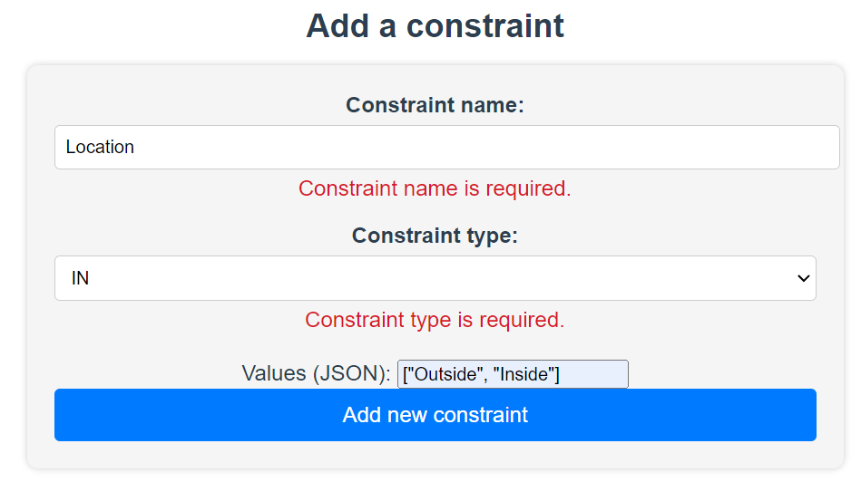
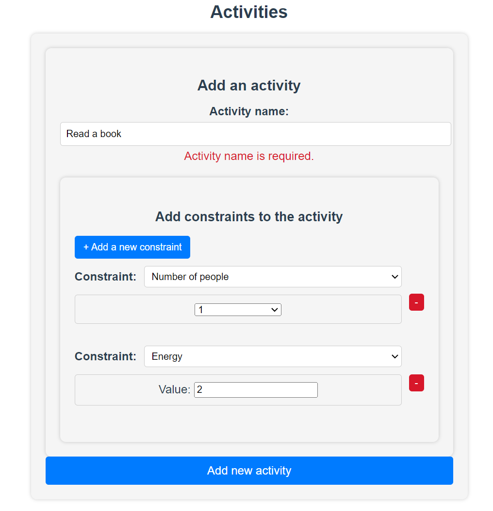
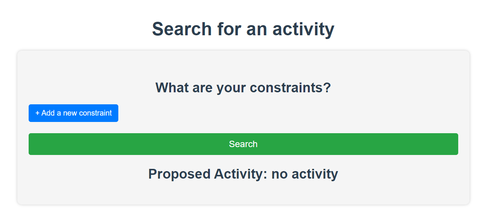
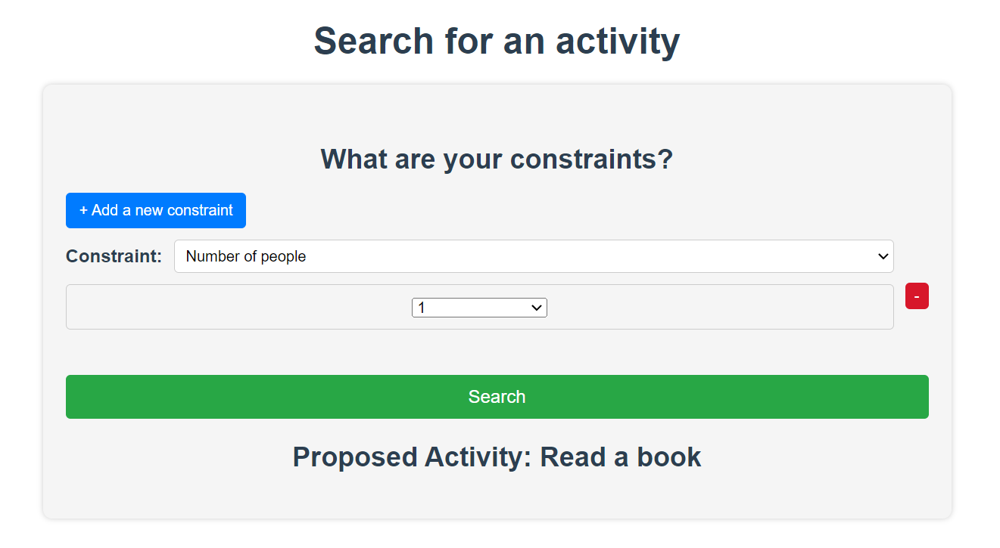

# Activity Generator

The Activity Generator is a user-friendly application designed to assist individuals in making decisions when selecting activities from a diverse range of options. By considering various constraints, users can receive tailored activity suggestions that align with their preferences and circumstances.

## Table of Contents

- [Introduction](#introduction)
- [Key Features](#key-features)
- [Getting Started](#getting-started)
  - [Prerequisites](#prerequisites)
  - [Installation](#installation)
  - [Running the Application](#running-the-application)
  - [Stopping the Application](#stopping-the-application)
- [Usage](#usage)
  - [Creating a New Constraint](#creating-a-new-constraint)
  - [Creating a New Activity](#creating-a-new-activity)
  - [Using Constraint Operators](#using-constraint-operators)
- [Technologies Used](#technologies-used)
- [Screenshots](#screenshots)
- [Contributing](#contributing)
- [License](#license)
- [Contact](#contact)

## Introduction

Indecision often plagues our choice-making process when seeking an activity to engage in. With countless factors to take into account, making a decision can become overwhelming. The Activity Generator aims to streamline this process by offering a dynamic solution. Users can define specific constraints, such as energy levels, location, and companionship preference. The application then generates personalized activity suggestions, curating an optimal experience for each user.

## Key Features

- Randomized Activity Suggestions: The application offers a randomized selection of activities that fulfill the user's specified constraints, promoting variety and spontaneity.

- Customizable Activities: Users have the ability to contribute their own activities to the app. Each activity can be enriched with individual constraints, enhancing the pool of options.

- Constraint Types: A unique feature of the Activity Generator is the inclusion of constraint types. Users can define new constraint types, such as 'energy' or 'mood', and set corresponding conditions using operators like '<=' or 'IN'. This empowers users to fine-tune their activity preferences according to specific criteria.

## Getting Started

To experience the Activity Generator firsthand and explore its functionalities, follow these steps to set up and run the project locally on your machine.

### Prerequisites

Before you begin, ensure you have the following tools and software installed on your system:

- Node.js (version 18.16 or higher)
- npm (usually comes with Node.js installation)

### Installation

1. Clone this repository: `git clone https://github.com/LaureneT/ActivityGenerator.git`
2. Navigate to the project directory: `cd ActivityGenerator`
3. Install Backend Dependencies: `npm install`
4. Navigate to the Frontend Directory: `cd ./frontend`
5. Install Frontend Dependencies: `npm install`

### Running the Application

1. Start the Backend Server from the root: `npm start`
2. Start the Vue.js Frontend from the 'frontend' directory: `npm run serve`
3. Open your browser and go to: `http://localhost:8081`

### Stopping the Application

To stop the servers and exit the application, you can press Ctrl + C in each terminal window where the servers are running.

## Usage

Once both the backend and frontend servers are running, you can use the Activity Generator:

- Access the application in your web browser by going to http://localhost:8081.
- Explore the interface, add activities, and experiment with different constraint types and values.
- Generate personalized activity suggestions based on your input constraints.

### Creating a New Constraint

You have the flexibility to create new constraint types to enhance the specificity of your activity suggestions:

- In the application interface, find the "Add a constraint" section.
- Enter a name for the new constraint type (e.g., "Mood," "Weather").
- Choose an operator for the constraint type. Currently, the supported operators are <= (less than or equal to) and IN (inclusive range).
- Save the new constraint type by clicking the "Add new constraint" button. 
- You can then choose this constraint in the "Add an activity" section.

### Creating a New Activity

To add a new activity to the Activity Generator, follow these steps:

- In the application interface, locate the "Add an activity" section.
- Provide a name for the activity in the designated input field.
- Assign relevant constraints to the activity. For example, you can specify that the activity requires a certain energy level or must be done indoors.
- Click the "Add new activity" button to save the new activity to the database.

### Using Constraint Operators

When adding or modifying constraints for an activity, you'll encounter constraint operators:

- <= (less than or equal to): Use this operator to set an upper limit on a constraint. For example, if you're feeling tired and want activities that require minimal energy, you might set an energy constraint of <= 3. All constraints with an energy > 3 will not satisfy this constraint.
- IN (inclusive range): This operator defines a range of acceptable values. For instance, you can specify a mood constraint of IN [happy, content] to indicate that you're interested in activities that match these moods. For now, you can enter the options of the IN operator as a JSON using this specific syntax : '[option1, option2, ...]'.

Remember that the more accurately you define constraints and activities, the better the Activity Generator can tailor its suggestions to your preferences.

## Technologies Used

The Activity Generator utilizes a modern tech stack for efficient and seamless performance:

- Frontend: Developed using Vue.js, the user interface is interactive, intuitive, and responsive.
- Backend: The application's backend logic is built using Node.js, enabling smooth communication between the frontend and the database.
- Database: The local database is managed by SQLite and accessed through Prisma, facilitating efficient data storage and retrieval.

## Screenshots

Add some constraints:

Add some activities:

Use the generator:

## License

This project is licensed under the MIT License - see the [LICENSE](LICENSE) file for details.

## Contact

Thank you for taking the time to explore the Activity Generator project. If you have any questions, feedback, or opportunities for collaboration, please feel free to reach out. I am excited about the potential to showcase my skills and contribute to meaningful projects.

You can connect with me via:

I look forward to hearing from you and am eager to discuss any inquiries you may have.
